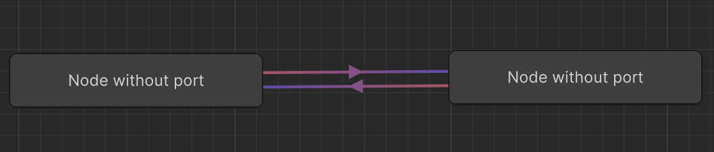
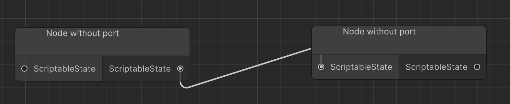

## How to Use: Implementing a GraphView for Your Tool Needs

**Table of Contents:**

- [Step 1: Create Node Data](#step-1-create-node-data)
- [Step 2: Create Node View](#step-2-create-node-view)
- [Step 3: Create Node Controller](#step-3-create-node-controller)
- [Step 4: Create GraphView](#step-4-create-graphview)
- [Step 5: Setup the UI](#step-5-set-up-the-ui)
- [Step 6: Populate the graph](#step-6-populate-the-graph)

### Step 1: Create Node Data

1. Define your own node data class that implements the [INode](Doc/INode.md) interface. This class will represent the data associated with your nodes.

   ```csharp
   public class MyNodeData : ScriptableObject, INode
   {
       // Define properties and methods for your node data.
       // ...
   }
   ```

### Step 2: Create Node View

1. Define your node view class that extends [NodeViewBase\<MyNodeData>](Doc/NodeViewBase.md). This class will handle the visualization and interaction of your nodes.
   ```csharp
   public class MyNodeView : NodeViewBase<MyNodeData>
   {
       // Implement methods and properties for node visualization and interaction.
       // ...
   }
   ```

2. Define your node type by overriding the `protected override NodeType Type` property. There are currently two types of node:
    2. a. `NodeType.WITHOUT_PORT`

    

    2. b. `NodeType.WITH_PORT`

    
    > :bulb: Styling is handled with stylesheets, this screenshot was made using the StateMachineGraphView styles which are not adapted to this NodeType.

**:rotating_light: Linking node of different types is not currently supported**

### Step 3: Create Node Controller

1. Define your node controller class that implements [INodeController\<MyNodeData>](Doc/INodeController.md). This class will manage the creation, deletion, and manipulation of node data.
   ```csharp
   public class MyNodeController : INodeController<MyNodeData>
   {
       // Implement methods for creating, deleting, and managing node data.
       // ...
   }
   ```

### Step 4: Create GraphView

1. Define your graph view class that extends [GraphViewBase<MyNodeView, MyNodeData>](Doc/GraphViewBase.md). This class will be your main graph view container.
   ```csharp
   public class MyGraphView : GraphViewBase<MyNodeView, MyNodeData>
   {
       // Implement methods and properties for the graph view behavior.
       // ...
   }
   ```
2. In your `MyGraphView` class, override the abstract methods to provide the base class with the required information.
   ```csharp
   // Set to true if you want to handle copy/paste.
   protected override bool HandlesCopyPaste => true;

   // Use your own node controller. 
   protected override INodeController<MyNodeData> CreateController() => new MyNodeController();
   ```

3. In your `MyGraphView` class, setup your UI needs such as adding a search window and a minimap.
    ```csharp
    public MyGraphView() 
    {
        AddMiniMap(); // Adds a default minimap.
        AddSearchWindow(); // Adds a default search window for node creation.
    }
    ```
    3. a. Each UI-setup related method is overloaded with a templated argument to make it possible for you to implement your own version.
        ```csharp
        public MyGraphView() 
        {
            AddMiniMap<MyMiniMap>(); // Adds your custom minimap.
            AddSearchWindow<MySearchWindow>(window => {
                /* Your initialization logic */
            }); // Adds your custom search window.
        }
        ```
4. In your `MyGraphView` class, override virtual methods to take advantage of events (see [Virtual methods](Doc/GraphViewBase.md#virtual-methods))
    ```csharp
    protected override void OnNodeCreated(MyNodeView nodeView) { /* Custom logic */ }
    protected override void OnNodeDeleted(MyNodeView nodeView) { /* Custom logic */ }
    ```

### Step 5: Set Up the UI

1. Create a new `VisualTreeAsset` or `UXML` file for your graph view UI.
2. Use the `MyGraphView` class to create an instance of your graph view and add it to your UI.
   ```csharp
   // Instantiate through code control
   var graphView = new MyGraphView();
   // Or fetch your uxml file
   var uxml = AssetDatabase.LoadAssetAtPath<VisualTreeAsset>("Path/To/Your/GraphViewUI.uxml");
   uxml.CloneTree(rootElement);
   rootElement.Q("graph-container").Add(graphView);
   ```

### Step 6: Populate the Graph

1. Call the `Populate()` method on your `MyGraphView` instance to populate the graph view with nodes and edges.
   ```csharp
   graphView.Populate();
   ```